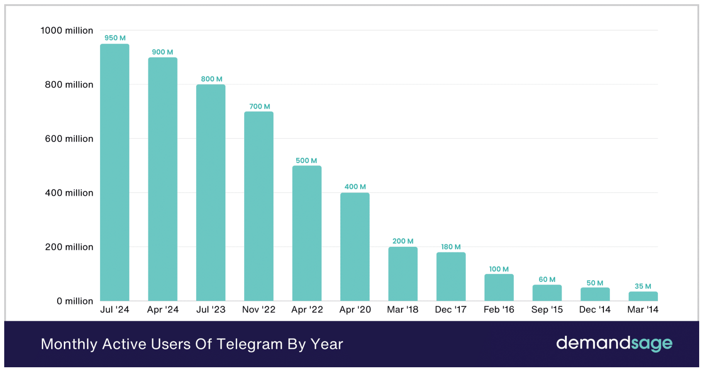
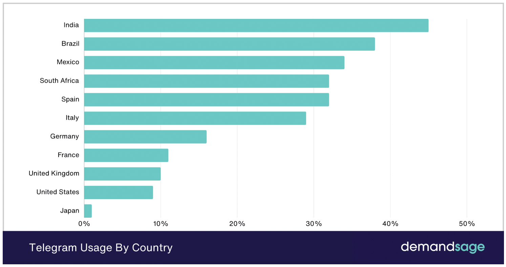
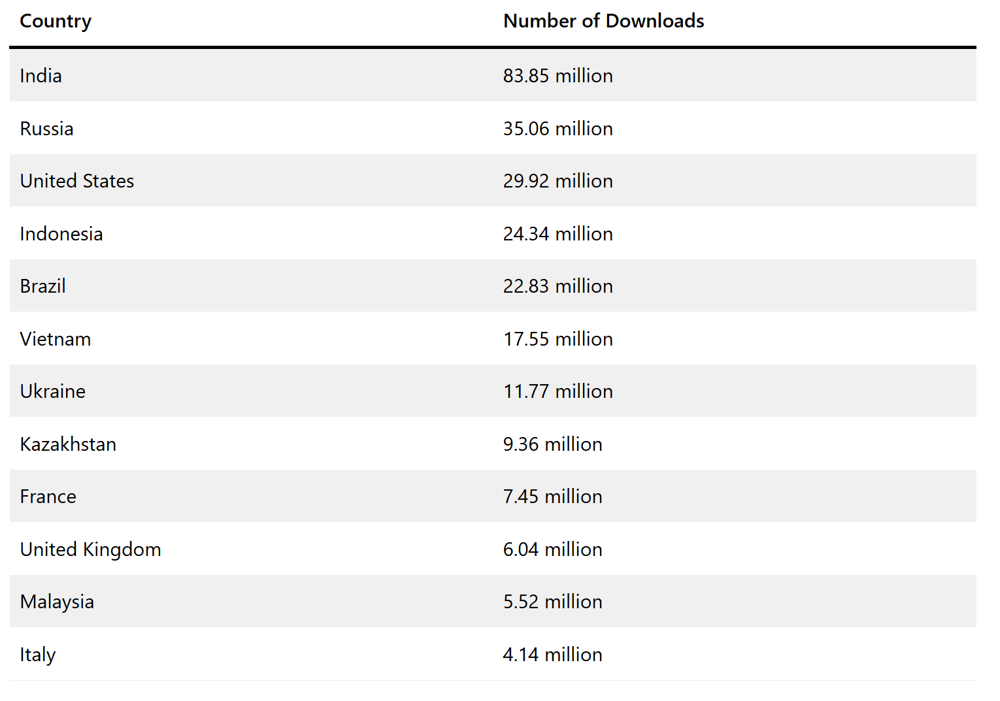

# Telegram 

## Содержание

- [Содержание](#содержание)
- [Основная часть](#основная-часть)
  - [1. Тема и целевая аудитория](#1-тема-и-целевая-аудитория)
    - [Анализ трафика и вовлеченности](#анализ-трафика-и-вовлеченности)
- [Список источников](#список-источников)

## Основная часть

### 1. Тема и целевая аудитория

**Telegram** - это мессенджер, который позволяет общаться с друзьями, коллегами и другими людьми

**MVP**
1. Регистрация и авторизация пользователей
2. Чтение и отправка сообщений
3. Создание и модерирование групповых чатов
4. Создание и модерирование каналов
5. Загрузка файлов
6. Добавление контактов

**Целевая аудитория**

### Анализ трафика и вовлеченности:

- Количество пользователей в месяц: 950 миллионов
- Количество пользователей в день: 450 миллионов
- 45% пользователей телеграмма - жители Индии, 9% - американцы
- 53.2% пользователей возрастом от 25 до 44 лет
- Среднее время использования телеграмма в месяц: 3 часа 45 минут
- Пользователей в России: 85 млн человек
- По загрузкам лидирует Индия, за ней Россия и США

**Пользователи в месяц по годам**

**Распределение пользователей по странам**

**Распределение загрузок приложения по странам**

## Список источников
- [Telegram Users Statistics (2025) –New Global Data](https://www.demandsage.com/telegram-statistics/)
- [Number of Telegram app downloads worldwide in 2024, by country](https://www.statista.com/statistics/1336855/telegram-downloads-by-country/)
- [Число пользователей Telegram в России выросло до 85 млн человек](https://www.forbes.ru/tekhnologii/507878-cislo-pol-zovatelej-telegram-v-rossii-vyroslo-do-85-mln-celovek)